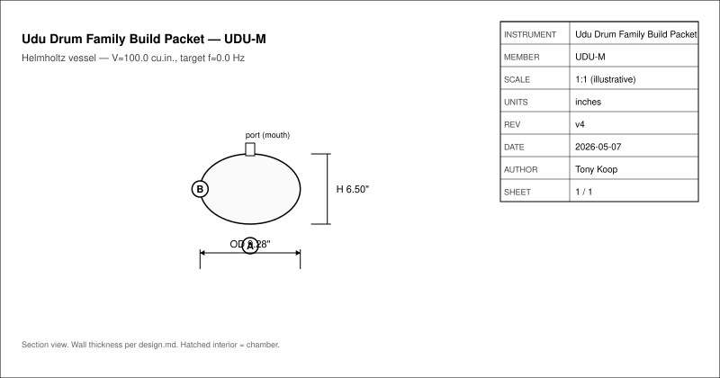
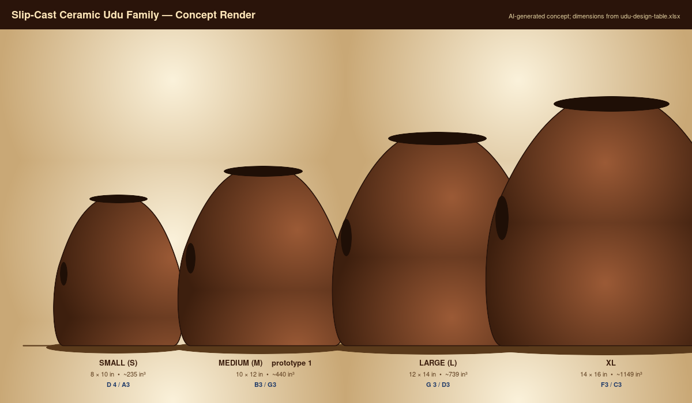
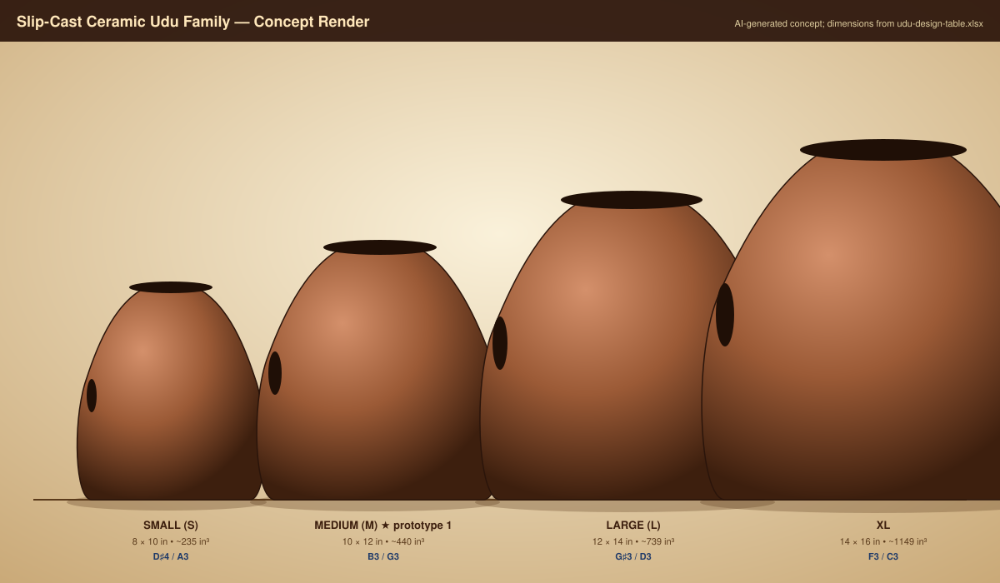
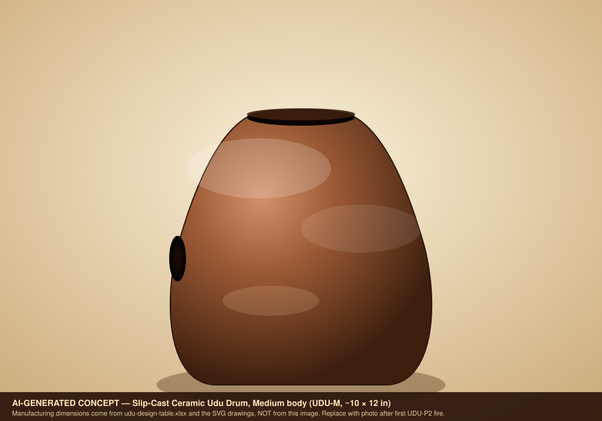

# Slip-Cast Ceramic Udu Drum Family — v4.1 Capstone
- Musical instrument documentation capstone
- Build packet: udu
- Generated: 2026-05-07

---

# Project Intent
- Build a slip-cast ceramic udu family — Small / Medium / Large / XL — with
repeatable chamber volumes and two playable Helmholtz tones: the main mouth
tone and the side-hole slap tone. The first production target is the
**Medium** standard udu (UDU-P2: 10 in × 12 in body, B3 mouth / G3 side),
followed by a scaled family. The udu (Igbo: *ụdụ*, "vessel") is a Nigerian
clay-vessel drum and the documentation here treats that lineage as fact, not
marketing.

_Speaker notes:_ Read design.md before committing to dimensions or sourcing decisions.

---

# Physics Model
- The udu uses a shared chamber with two coupled Helmholtz resonators:

```
f_top  = c/(2*pi) * sqrt( A_top  / (V * L_top)  )
f_side = c/(2*pi) * sqrt( A_side / (V * L_side) )
L      = wall_thickness + 0.6 * sqrt(A/pi)
V      = (pi/6) * body_diam^2 * body_height * shape_factor
```

_Speaker notes:_ Governing equations extracted verbatim from design.md. Apply empirical corrections (NAF K2, scale offsets) only where the model permits — see references/acoustic-models.md.

---

# Hardware Alignment
- This repo is one of the slip-cast targets for the in-flight Bambu printer +
ceramic kiln pipeline shared with `ocarina/`, `gemshorn/`, and
`transverse-flute/`. The build chain:

| Stage | Tool / pipeline | Notes |
| --- | --- | --- |
| Design table | `udu-design-table.xlsx` Master_Inputs | Blue cells = inputs; volume formula derived |
| Master scaling | `master_scale_factor = 1/(1 - measured_shrinkage)` | Re-derive per slip batch — see risks.md SUP-01 |
| Master print | Bambu X1C (UDU-S, UDU-M) or outsourced print (UDU-L, UDU-XL) | X1C envelope ≈ 256 mm; L/XL exceed it — see risks.md SUP-02 |
| Mold | Two-piece plaster mother mold, USG #1 pottery plaster | Split line off the hand-contact equator |
| Cast | Cone 6 stoneware casting slip | Shrinkage coupon required per batch |
| Trim | Side hole cut at leather-hard, undersized | Final tune at bisque |
| Fire | Cone 06 bisque → Cone 6 glaze | Glaze exterior only |
| Validate | `validation.csv` mouth/side/coupled measurements | `record_measurement.py` updates per-family corrections |
| CAD round-trip | `UDU-000_MasterLayout.SLDPRT` ↔ `cad/sw-design-table.xlsx` | See `sw-reference/` for the SW workflow |

_Speaker notes:_ Identifies which shop pipeline(s) this instrument lives in: Bambu+kiln slip-cast, 40W laser flat-pack, CNC+lathe, segmented turning, drum-skin work, or hybrid combinations.

---

# How To Use This Packet
- Start with design.md for intent and assumptions.
- Use bom.csv, sourcing.csv, and cut-list.csv before buying or cutting.
- Use drawing-brief.md and CAD/CNC folders before machining.
- Print the packet for shopping, shop work, and validation.

---

# File Map
- design.md: Project intent, catalog metadata, assumptions, and validation plan.
- bom.csv: Starter bill of materials with part categories, quantities, drawing refs, and notes.
- sourcing.csv: Supplier/search tracker with specs, price/date fields, lead time, substitutes, and risks.
- cut-list.csv: Rough/final stock sizes, material, grain/orientation, operations, yield, and offcuts.
- drawing-brief.md: Manufacturing drawing and technical product sketch brief.
- assembly-manual.md: Shop-facing sequence, tools, fixtures, safety, tuning, finishing, and maintenance notes.
- validation.csv: Target/measured values, tolerance, environment, result, and tuning/build action log.
- supplier-rfq.md: Supplier email/request-for-quote starter.

---

# Family Spec

| member_id | target_note_mouth | target_hz_mouth | target_note_side | target_hz_side | body_diam_in | body_height_in | wall_thk_in | mouth_diam_in | side_diam_in | shape_factor | chamber_volume_cuin | predicted_hz_mouth | predicted_hz_side | cents_error_mouth | cents_error_side | master_scale_factor | clay_body | shrinkage_pct | reference_repo | notes |
| --- | --- | --- | --- | --- | --- | --- | --- | --- | --- | --- | --- | --- | --- | --- | --- | --- | --- | --- | --- | --- |
| UDU-S | D#4 | 311.13 | A3 | 220.00 | 8.0 | 10.0 | 0.30 | 3.0 | 2.0 | 0.70 | 234.6 | 340.8 | 262.4 | +157 | +304 | 1.136 | Cone 6 stoneware | 12 | udu | Small/tabletop. Predictions sharp of targets — mouth dia likely needs to drop ~2.5 in OR shape factor increased to reduce predicted Hz; flag for empirical UDU-P1 measurement. |
| UDU-M | B3 | 246.94 | G3 | 196.00 | 10.0 | 12.0 | 0.30 | 3.0 | 2.0 | 0.70 | 439.8 | 248.9 | 191.6 | +14 | -39 | 1.136 | Cone 6 stoneware | 12 | udu | Medium/standard. Workbook prototype-1 target. Predictions within ±50¢ of targets — hits the v4 design-table band. |
| UDU-L | G#3 | 207.65 | D3 | 146.83 | 12.0 | 14.0 | 0.30 | 3.0 | 2.0 | 0.70 | 738.8 | 192.1 | 148.0 | -126 | +14 | 1.136 | Cone 6 stoneware | 12 | udu | Large/deep bass. Mouth prediction flat of target — port may need to enlarge slightly OR shape factor reduced; flag for empirical UDU-L measurement. |
| UDU-XL | F3 | 174.61 | C3 | 130.81 | 14.0 | 16.0 | 0.30 | 3.0 | 2.0 | 0.70 | 1148.7 | 153.9 | 118.5 | -220 | -172 | 1.136 | Cone 6 stoneware | 12 | udu | Concert bass. Predictions flat across both ports — XL may need port scaling (mouth 3.5+ in) to recover pitch; needs stand. Flag as design risk — see risks.md. |

_Speaker notes:_ Sizes scale via the master scale factor; tuning targets are first-order Helmholtz/cantilever predictions to be empirically corrected per prototype.

---

# Build Workflow
- Design and assumptions
- Source materials and hardware
- Prepare stock, fixtures, and CNC/laser/lathe setup
- Assemble, tune, finish, and validate

---

# Sourcing And BOM
- BOM gives part categories and drawing references.
- Sourcing tracks search terms, supplier candidates, price/date, lead time, substitutions.
- Visual BOM brief turns the parts list into a presentation-ready image board.

---

# Shop Packet
- Cut list for lumber/sheet/blank planning.
- Assembly manual for away-from-keyboard work.
- Validation sheet for measured dimensions, tuning, pass/fail checks.

---

# Drawings, CAD, CNC
- drawing-brief.md defines required views, dimensions, datums, sketch intent.
- cad/ holds models and design tables.
- cnc/ holds CAM, toolpaths, setup sheets, dry-run notes.
- drawings/ holds PDFs, SVGs, DXFs, drawing exports.





---

# Images And Screenshots
- images/family-overview-concept.png
- images/family-overview-concept.svg
- images/hero-concept.png
- images/hero-concept.svg






---

# Validation Plan
- A4 = 440 Hz reference check.
- Tuning targets logged in validation.csv.
- Critical dimensions verified against design sheet and CAD.
- Photos and revision notes after each major step.

---

# Open Risks / Decisions
- TBDs in design sheet and BOM.
- Supplier price/availability not yet verified.
- Generated images marked as concept placeholders.
- Empirical corrections await measured prototype data.

---

# Next Actions
- Replace TBDs with measured/source-backed values.
- Verify live supplier price and availability before buying.
- Export final drawings and visual BOM images.
- Regenerate this deck and print packet after final edits.

---
