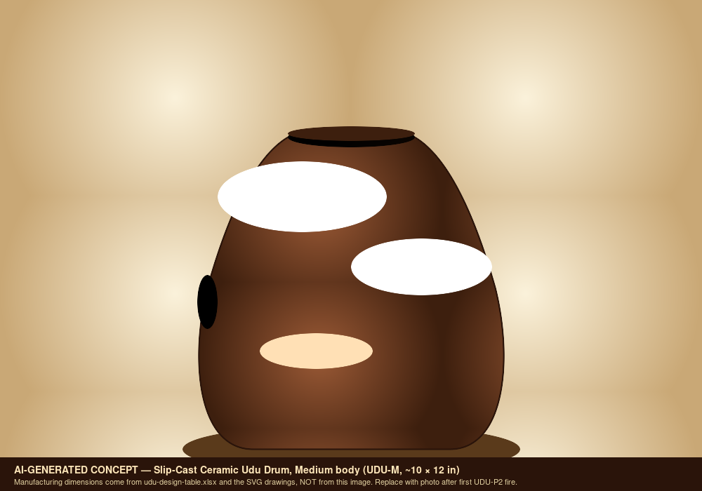

# Slip-Cast Ceramic Udu Drum Family (UDU-001) — Build Packet Print Packet

Generated: 2026-05-02
Packet folder: `/sessions/charming-bold-fermat/mnt/GitHub/udu`

## File Map

| File | Purpose |
| --- | --- |
| `design.md` | Project intent, catalog metadata, assumptions, and validation plan. |
| `bom.csv` | Starter bill of materials with part categories, quantities, drawing refs, and notes. |
| `sourcing.csv` | Supplier/search tracker with specs, price/date fields, lead time, substitutes, and risks. |
| `cut-list.csv` | Rough/final stock sizes, material, grain/orientation, operations, yield, and offcuts. |
| `drawing-brief.md` | Manufacturing drawing and technical product sketch brief. |
| `assembly-manual.md` | Shop-facing sequence, tools, fixtures, safety, tuning, finishing, and maintenance notes. |
| `validation.csv` | Target/measured values, tolerance, environment, result, and tuning/build action log. |
| `supplier-rfq.md` | Supplier email/request-for-quote starter. |
| `visual-bom-brief.md` | Art direction for an image-forward visual BOM. |
| `wolfram-starter.wl` | Wolfram starter for physics, optimization, visualization, and validation. |
| `README.md` | Project artifact. |
| `capstone-deck.md` | Project artifact. |
| `print-packet.md` | Project artifact. |

<div class="page-break"></div>

## design.md

Project intent, catalog metadata, assumptions, and validation plan.

# Udu Drum Family Build Packet

## Source

- Design table: `docs/Udu.xlsx`
- Sheet: `Udu Drum Family`
- Inspected range: `A1:H146`
- Workbook content observed: design inputs, dual Helmholtz calculator, four-size family, variants, playing techniques, ceramic production workflow, BOM, design notes, and Wolfram notebook notes.

## Design Intent

Build a slip-cast ceramic udu family with repeatable chamber volumes and two playable Helmholtz tones: the main mouth tone and the side-hole slap tone. The first production target is the medium standard udu, followed by a scaled family.

## Governing Model

The udu uses a shared chamber with two main ports:

```text
f_top = c/(2*pi) * sqrt(A_top/(V * L_top))
f_side = c/(2*pi) * sqrt(A_side/(V * L_side))
```

When both ports are open and the player's hands move, the modes couple. The single-port formulas are useful first-order targets; measured prototypes should define the final tuning corrections.

## Current Workbook Inputs

| Field | Current value |
| --- | --- |
| Body diameter | 10 in |
| Body height | 12 in |
| Wall thickness | 0.3 in |
| Mouth diameter | 3 in |
| Side hole diameter | 2 in |
| Shape factor | 0.7 |
| Clay body | Cone 6 stoneware |
| Shrinkage | 0.12 |
| Speed of sound | 13510 in/s |

## Current Family Targets

| Model | Diameter | Height | Volume | Mouth tone | Side tone | Use |
| --- | ---: | ---: | ---: | --- | --- | --- |
| Small | 8 in | 10 in | 235 in3 | D#4 | A3 | Tabletop and high tones |
| Medium | 10 in | 12 in | 440 in3 | B3 | G3 | Most versatile standard size |
| Large | 12 in | 14 in | 739 in3 | G#3 | D3 | Deep bass and traditional feel |
| XL | 14 in | 16 in | 1149 in3 | F3 | C3 | Concert bass, likely needs stand |

## Critical Design Features

- Body volume controls both main tones; slip casting is valuable because it makes volume repeatable.
- Port diameters and effective neck lengths are the main pitch controls.
- Wall thickness controls shell tap tone, durability, drying risk, and weight more than Helmholtz pitch.
- The side hole edge must be comfortable for repeated hand slaps.
- The mouth rim should be rounded enough for comfort but consistent enough for repeatable hand sealing.
- Feet, stand interface, or flat area should be designed before the mold if the instrument needs stability.

## Cultural And Product Note

The udu has Igbo roots and is not just a generic ceramic bass pot. Public-facing copy should be respectful, specific, and verified before publication. For Tony's own build docs, keep the lineage note visible and separate it from product marketing.

## Mold Strategy

Recommended first production mold:

- Two-piece plaster body mold split near the widest diameter.
- Separate mouth/neck core or hand-cut mouth after demold if that gives cleaner release.
- Side hole cut at leather-hard stage so tuning can be adjusted by cutter size and file work.
- Smooth mold split where hand contact will happen.
- Add subtle foot pads or a stand-contact feature if the final instrument should sit safely.

Master scale factor:

```text
scale = 1/(1 - shrinkage)
```

For 12 percent shrinkage, use approximately `1.136` before adjusting for measured clay data.

## Prototype Ladder

| Prototype | Goal | Success criteria |
| --- | --- | --- |
| UDU-P0 cup/port tile | Validate clay wall/tap behavior | No cracks; clear ceramic tap; clean port edge |
| UDU-P1 small body | Validate slip casting and side-hole slap | Measurable Helmholtz tone, comfortable slap edge |
| UDU-P2 medium body | Hit workbook medium target | Mouth and side tones within +/-50 cents after bisque |
| UDU-P3 water udu | Explore pitch-bending volume | Smooth tilt-bend without leaking or handling risk |
| UDU-P4 family molds | Scale S/M/L/XL | Predictable pitch trend across sizes |

## Workbook Improvement Notes

Recommended next workbook additions:

1. Add measured frequency and cents-error fields for mouth, side hole, and both-open condition.
2. Add cast-wall thickness measured at rim, shoulder, belly, and foot.
3. Add water-fill chamber volume after bisque and glaze fire.
4. Add per-size CAD master dimensions and shrinkage-compensated dimensions.
5. Add a coupled-mode experiment table for both ports open, side port covered, and mouth hand-muted.

## Open Assumptions

- Workbook costs are estimates and have not been date-checked.
- The side-hole tuning note in the workbook should be validated empirically; for a simple Helmholtz port, enlarging a port usually raises its open-port resonance, but hand coupling can make perceived playing behavior more complicated.
- Exact mold split and pour/drain design depend on final body shape.

<div class="page-break"></div>

## bom.csv

Starter bill of materials with part categories, quantities, drawing refs, and notes.

| item_id | category | item | qty | spec | make_buy | estimated_cost | source_note | drawing_ref | notes |
| --- | --- | --- | --- | --- | --- | --- | --- | --- | --- |
| UDU-BOM-001 | Clay | Cone 6 casting slip | 5 gal | Commercial premixed stoneware casting slip | Buy | $35-50 | Workbook estimate not date-checked | UDU-DRW-003 | Enough for roughly 8-12 medium udus per workbook note. |
| UDU-BOM-002 | Mold | #1 pottery plaster | 50 lb | Pottery plaster for 2-piece mold | Buy | $25-35 | Workbook estimate not date-checked | UDU-DRW-002 | Record plaster ratio and mold dry weight. |
| UDU-BOM-003 | Master | 3D printed master | 2 halves | PLA master scaled for shrinkage | Make | $5-15 | Workbook estimate not date-checked | UDU-DRW-001 | Sand and seal before mold making. |
| UDU-BOM-004 | Mold | Mold soap/release | 1 bottle | Plaster-compatible release | Buy | $8-12 | Workbook estimate not date-checked | UDU-DRW-002 | Use on sealed master and plaster parting faces. |
| UDU-BOM-005 | Cutting | Hole cutter set | 1 set | 1.5 in to 3 in round cutters | Buy | $10-20 | Workbook estimate not date-checked | UDU-DRW-004 | Cut side hole at leather-hard stage. |
| UDU-BOM-006 | Firing | Bisque and glaze firing | 2 fires | Cone 06 bisque and Cone 6 glaze | Buy | $20-50/fire | Workbook estimate not date-checked | UDU-VAL-002 | Record schedule and kiln. |
| UDU-BOM-007 | Finish | Exterior glaze | 1 pint | Cone 6 matte or satin glaze | Buy | $10-20 | Workbook estimate not date-checked | UDU-DRW-005 | Leave interior unglazed. |
| UDU-BOM-008 | Hardware | Rubber feet | 1 set | Three low-profile feet | Buy | $3-5 | Workbook estimate not date-checked | UDU-DRW-006 | Optional; test effect on shell resonance. |
| UDU-BOM-009 | Electronics | Contact pickup | 1 | Piezo disc/contact mic | Buy | $15-30 | Workbook estimate not date-checked | UDU-DRW-007 | Optional electric variant. |
| UDU-BOM-010 | Measurement | Water-fill and frequency measurement kit | 1 | Graduated vessel plus tuner/mic | Buy | TBD | Add supplier/date before purchase | UDU-VAL-003 | Required for empirical correction loop. |

<div class="page-break"></div>

## sourcing.csv

Supplier/search tracker with specs, price/date fields, lead time, substitutes, and risks.

| item_id | item | required_spec | search_terms | supplier_candidates | date_checked | unit_price | lead_time | substitution_rule | risk_note |
| --- | --- | --- | --- | --- | --- | --- | --- | --- | --- |
| UDU-SRC-001 | Cone 6 casting slip | Stoneware casting slip with known shrinkage and mature Cone 6 schedule | cone 6 stoneware casting slip 5 gallon shrinkage | TBD |  |  |  | Substitute only with shrinkage test bars | Unknown shrinkage changes volume and pitch. |
| UDU-SRC-002 | #1 pottery plaster | Absorbent pottery mold plaster in 50 lb quantity | USG #1 pottery plaster 50 lb | TBD |  |  |  | Equivalent pottery plaster acceptable if absorption is proven | Weak plaster shortens mold life. |
| UDU-SRC-003 | PLA filament | Stable print material for large master halves | PLA filament large format mold master | TBD |  |  |  | Resin or outsourced print acceptable if sealed | Print warping changes mold volume. |
| UDU-SRC-004 | Mold release | Plaster-compatible parting/release compound | pottery mold soap plaster release | TBD |  |  |  | Use known ceramic mold release | Release failure can destroy the master. |
| UDU-SRC-005 | Hole cutters | Clean round cutters from 1.5 in to 3 in | ceramic hole cutter round clay 2 inch 3 inch | TBD |  |  |  | Custom brass tube cutters acceptable | Ragged side hole edge hurts playability. |
| UDU-SRC-006 | Rubber feet | Low profile feet with adhesive or mechanical mount | rubber feet ceramic instrument low profile | TBD |  |  |  | Use removable feet during acoustic tests | Feet can damp shell tap tone. |
| UDU-SRC-007 | Piezo pickup | Contact pickup that can survive installation method | piezo disc contact pickup drum ceramic | TBD |  |  |  | External contact mic acceptable for prototype | Internal epoxy is hard to reverse. |

<div class="page-break"></div>

## cut-list.csv

Rough/final stock sizes, material, grain/orientation, operations, yield, and offcuts.

| cut_id | part | qty | rough_dimensions_in | final_dimensions_in | material | orientation | operation | tolerance_in | yield_or_offcut | notes |
| --- | --- | --- | --- | --- | --- | --- | --- | --- | --- | --- |
| UDU-CUT-001 | Master body upper half (3D-printed) — Medium | 1 | 12 x 12 x 7 envelope | master scaled by 1/(1-shrinkage); ~1.136x at 12% shrinkage | PLA or sealable resin | Z up; mark mouth axis + side-hole datum | Print in 2-3 sessions; sand layer lines; fill voids; seal | +/-0.020 | Reuse offcut sprues for shrinkage coupons | Master scale factor must be re-derived from MEASURED clay shrinkage before final master. |
| UDU-CUT-002 | Master body lower half (3D-printed) — Medium | 1 | 12 x 12 x 7 envelope | mirror of UDU-CUT-001 | PLA or sealable resin | Z up; mark split-line datum | Print sand fill seal | +/-0.020 | Reuse offcut sprues | Same scale factor as UDU-CUT-001. |
| UDU-CUT-003 | Wooden cottle boards (mold making) | 4 | 18 x 16 x 0.75 each | 16 x 14 x 0.75 each | Melamine-faced MDF | Smooth face inward; mark inner clamping zone | Cut edge-seal drill clamping holes | +/-0.030 | One sheet of 4ft x 8ft x 0.75 yields all 4 plus 50% of next mold set | Clean parting wax/release before each pour. |
| UDU-CUT-004 | Plaster mother mold half (poured) — Medium | 2 | 16 x 14 x 4 each | 16 x 14 x 3.5-3.75 each (around master) | USG #1 pottery plaster (or equiv.) | Pour with master keyed to first half; second half over registration | Mix to 73:100 water:plaster (by weight); 2-min slake; pour around sealed master | +/-0.10 | Trim spew/edge after demold; recover small offcuts as test slabs | Min 1.50 in plaster around master; 2.0 in preferred for medium-size pour stiffness. |
| UDU-CUT-005 | Greenware vessel (slip-cast) — Medium | 1 per pour | master cavity wet (~12 x 14 x 7 OD) | ~10.6 x 12.4 x 6.2 fired (12% shrink) | Cone 6 stoneware casting slip | Mouth axis along master split | Slip pour > drain at target wall (~0.30 in / 7.6 mm) > demold leather-hard | N/A (process-controlled) | Reuse demold trim/fettling waste as slip recycle | Wall thickness drives drying time and tap tone — measure on noncritical trim. |
| UDU-CUT-006 | Mouth opening (cast as part of master) | 1 | N/A | 3.0 in dia FIRED (=3.41 in master) | Cone 6 greenware | Top of body — central | Cast cleanly via mold shape; rim-round at leather-hard | +/-0.030 | N/A | Round rim radius for repeated hand-seal comfort. |
| UDU-CUT-007 | Side hole (leather-hard cut) | 1 per body | N/A | 2.0 in dia FIRED | Cone 6 greenware | Side of body at hand-comfort height | Brass tube cutter or hole punch at leather-hard; clean burr with damp finger | +/-0.030 (start) | N/A | Cut undersized; final tune at bisque if pitch off >50 cents. |
| UDU-CUT-008 | Foot pads (optional — cast-in or applied) | 3 per body | N/A | ~0.5 in dia x 0.10 in tall | Rubber adhesive feet OR cast-in clay foot | Tripod 120 deg around base | Apply post-glaze fire OR cast as part of master | +/-0.030 | N/A | Test with and without feet; feet damp shell tap tone (acoustic trade-off). |
| UDU-CUT-009 | Post-bisque tuning trim | as needed | N/A | Within +/-50 cents of target frequency per validation.csv | Bisqued ceramic | N/A | Diamond burr in steps; enlarge mouth or side hole to raise pitch | +/-0.020 dimensional; +/-50 cents acoustic | N/A | Document each enlarge step on validation row. Hand coupling shifts perceived pitch — measure both with and without hand seal. |
| UDU-CUT-010 | Wax resist mask (pre-glaze) | 1 application | N/A | ~0.020 in dry film over mouth rim + side hole edge + interior | Brushable wax resist | N/A | Brush-apply; dry per supplier; check all openings clear | Visual | N/A | Mask edges where hand contact happens to keep glaze surface clean. |
| UDU-CUT-011 | Glaze application (exterior only) | 1 application | N/A | ~0.010-0.020 in per coat; 1 coat exterior matte | Cone 6 satin or matte glaze | Avoid waxed regions and mouth/side-hole interiors | Dip / brush / spray exterior only | +/-0.010 (visual) | N/A | Heavy glaze damps shell tap. Keep coat thin. |
| UDU-CUT-012 | Family scaling — Small / Large / XL master variants | 1 set each | Per design table family-spec rows | Per design table fired dimensions | Same as UDU-CUT-001/002 | Per family | Print/master/mold parallel pipeline once Medium voicing is stable | +/-0.025 | Each size needs its own cottle set | Defer until UDU-P2 medium prototype validates wall thickness + mouth/side ratio. |

<div class="page-break"></div>

## drawing-brief.md

Manufacturing drawing and technical product sketch brief.

# Udu Drum Family Drawing Brief

## Required Views

- Front view with overall height, max body diameter, mouth diameter, and side-hole position.
- Side view showing body profile, wall target, side-hole axis, and foot/stand contact.
- Top view showing mouth opening, rim radius, and symmetry datums.
- Section view through mouth and side hole showing wall thickness and effective neck length.
- Mold split view with registration keys, plaster thickness, pour/drain direction, and seam-cleanup zone.
- Optional electric variant view showing piezo location, wire path, jack location, and service access.

## Critical Dimensions

| Dimension | Source | Tolerance intent |
| --- | --- | --- |
| Chamber volume | Workbook formula and water-fill measurement | Tuning critical |
| Body diameter and height | Workbook inputs | Tuning and ergonomics |
| Mouth diameter | Workbook input | Tuning and hand seal |
| Side-hole diameter | Workbook input and tuning log | Tuning and playability |
| Wall thickness | Workbook input and cast measurement | Tap tone/durability |
| Rim radii | CAD and ergonomic test | Comfort |
| Master scale factor | Measured clay shrinkage | Process critical |

## Notes For CAD

- Use a named shape factor or profile parameter so S/M/L/XL can be regenerated from the same model.
- Keep side-hole position as a parameter tied to hand comfort, not only aesthetics.
- Design any feet as optional variants so acoustic damping can be tested.
- Keep the water-udu variant separate because water fill and leak-tightness change requirements.

<div class="page-break"></div>

## assembly-manual.md

Shop-facing sequence, tools, fixtures, safety, tuning, finishing, and maintenance notes.

# Udu Drum Family Assembly Manual

## Scope

This manual covers slip-cast ceramic udu prototypes based on `docs/Udu.xlsx`, starting with the medium standard udu and expanding to a scaled family.

## Tools

- CAD package for body profile and mold split.
- Large-format 3D printer or outsourced print for master halves.
- Plaster mold-making setup: cottle boards, scale, bucket, plaster, mold soap, clamps.
- Cone 6 stoneware casting slip.
- Hole cutters, ribs, sponges, fettling knife, rasp, and small files.
- Calipers, wall-thickness gauge if available, graduated water-fill vessel, tuner/microphone.
- Kiln access, wax resist, exterior glaze.
- Optional: rubber feet, stand prototype, piezo/contact mic.

## Process

1. **Choose size**
   - Start with the medium workbook design unless testing mold workflow at smaller scale.
   - Assign build ID and expected shrinkage.

2. **CAD body and mold strategy**
   - Model the target fired body first.
   - Add shrinkage scale to produce the master body.
   - Choose a split line that releases cleanly and avoids hand-contact ridges.

3. **Print and seal master**
   - Print master halves rigid enough for plaster.
   - Sand high layer lines, fill defects, and seal.
   - Verify master diameter and height before molding.

4. **Make plaster mold**
   - Apply release.
   - Pour mold halves with registration keys.
   - Dry completely before first casting.
   - Record mold dry weight and first-use date.

5. **Slip cast**
   - Fill mold with slip.
   - Drain after target wall thickness buildup.
   - Record fill time, drain time, slip batch, room condition, and demold time.

6. **Leather-hard work**
   - Clean seam.
   - Cut side hole undersized or at first target.
   - Round mouth and side-hole edges.
   - Add foot/stand features only if they do not trap drying stress.

7. **Dry**
   - Dry under plastic for even moisture.
   - Rotate periodically if needed.
   - Inspect rim, side hole, foot, and seam.

8. **Bisque fire**
   - Fire to the clay body's bisque schedule.
   - Measure dimensions, chamber volume, mass, and pitch.

9. **Tune**
   - Tune with small changes and document each pass.
   - For simple open-port Helmholtz behavior, larger port area usually raises resonance; hand-covered playing conditions should be measured separately.
   - Do not remove more material until the measurement setup is repeatable.

10. **Glaze**
    - Glaze exterior only unless intentionally testing interior glaze damping.
    - Keep mouth and side-hole edges clean.

11. **Final validation**
    - Measure final tones, shell tap, weight, stability, and ergonomics.
    - Record whether feet or stands damp the ceramic tap tone.

## Failure Modes To Watch

- Cracks at side hole: hole cut too late, edge too sharp, or drying too fast.
- Dead bass response: chamber too small, ports poorly proportioned, walls too thick, or hand seal poor.
- Uncomfortable slap edge: rim needs larger radius or smoother fired edge.
- Warped base: unsupported drying or uneven mold thickness.
- Over-damped shell: glaze too heavy, feet too soft, or wall too thick.

<div class="page-break"></div>

## validation.csv

Target/measured values, tolerance, environment, result, and tuning/build action log.

| build_id | stage | date | model | clay_body | shrinkage_expected_pct | master_scale_factor | body_diam_in | body_height_in | wall_thickness_in | chamber_volume_in3 | mouth_diam_in | side_hole_diam_in | condition | target_note | target_freq_hz | measured_freq_hz | cents_error | action | result | notes |
| --- | --- | --- | --- | --- | --- | --- | --- | --- | --- | --- | --- | --- | --- | --- | --- | --- | --- | --- | --- | --- |
| UDU-P1 | greenware |  | Small |  |  |  | 8 | 10 | TBD | TBD | 3 | 2 | mouth_open | D#4 | 311 |  |  |  |  | First slip-cast body check. |
| UDU-P1 | bisque |  | Small |  |  |  | TBD | TBD | TBD | TBD | TBD | TBD | mouth_open | D#4 | 311 |  |  |  |  | Measure after shrinkage. |
| UDU-P1 | bisque |  | Small |  |  |  | TBD | TBD | TBD | TBD | TBD | TBD | side_open | A3 | 223 |  |  |  |  | Check hand slap response. |
| UDU-P2 | greenware |  | Medium |  |  |  | 10 | 12 | 0.3 | 440 | 3 | 2 | mouth_open | B3 | 249 |  |  |  |  | Workbook standard target. |
| UDU-P2 | bisque |  | Medium |  |  |  | TBD | TBD | TBD | TBD | TBD | TBD | mouth_open | B3 | 249 |  |  |  |  | Primary tuning checkpoint. |
| UDU-P2 | bisque |  | Medium |  |  |  | TBD | TBD | TBD | TBD | TBD | TBD | side_open | G3 | 192 |  |  |  |  | Record whether perceived pitch matches formula. |
| UDU-P2 | glaze_fire |  | Medium |  |  |  | TBD | TBD | TBD | TBD | TBD | TBD | mouth_open | B3 | 249 |  |  |  |  | Measure glaze shift. |
| UDU-P3 | bisque |  | Water udu |  |  |  | TBD | TBD | TBD | TBD | TBD | TBD | tilt_sweep | TBD | TBD |  |  |  |  | Record water amount and sweep range. |

<div class="page-break"></div>

## supplier-rfq.md

Supplier email/request-for-quote starter.

# Supplier RFQ — Slip-Cast Ceramic Udu Drum Family (UDU-001 family)

> Use this as a template for outreach to ceramic-supply, plaster, mold-making, and finishing suppliers. Customize the Subject and address fields per recipient.

**Subject:** RFQ — slip-cast ceramic udu drum prototype materials and consumables

Hello,

I'm a mechanical R&D engineer prototyping a small family of slip-cast ceramic udu drums (Igbo-rooted clay vessel drum, S/M/L/XL sizes, ~8-14 in body diameter, ~0.30 in / 7.6 mm wall) and need quotes for the following. The first build is a Medium standard udu (10 in dia × 12 in tall, target mouth tone B3 ≈ 247 Hz, side-hole tone G3 ≈ 196 Hz) based on the parametric dual-Helmholtz design table at [tonykoop/udu](https://github.com/tonykoop/udu).

## Items

| # | Item | Required spec | Approx. qty (per prototype run) |
|---|---|---|---|
| 1 | Cone 6 stoneware casting slip | Mature Cone 6 stoneware slip with **published shrinkage** (X/Y/Z), **water absorption %**, and **firing schedule**. Larger pour volumes than typical small-vessel work — slip needs to flow predictably into a 12+ in master cavity without cracking on drain. | 5 gal (Medium) — 15 gal (S/M/L/XL set) |
| 2 | #1 pottery plaster (large mold scale) | USG #1 Pottery Plaster (or equivalent) suitable for a 16 × 14 × 4 in two-piece pour. Need **water:plaster ratio**, **set time**, and **dimensional stability** (creep) over months of use. | 50 lb (single Medium mold) — 200 lb (full S/M/L/XL set) |
| 3 | Mold release / mold soap | Plaster-compatible parting agent. Larger surface area than small vessels — needs to release cleanly off a 12+ in body without locking. | 2 bottles / 32 oz |
| 4 | Cone 6 exterior glaze | Satin or matte glaze. **Color: TBD** — earth tones / iron oxide / rust red are visually closer to traditional fired Igbo-clay ware. Glaze must NOT bridge mouth or side-hole edges (acoustic-critical). | 1-2 pints per body |
| 5 | Brushable wax resist | Standard ceramic wax resist for masking mouth rim, side-hole rim, and chamber interior pre-glaze. | 1 jar / 16 oz |
| 6 | Hole cutter set | Round cutters, **1.5 in to 3 in diameter**, for greenware side-hole cutting. Brass tube cutters or commercial hole-cutter discs both acceptable. | 1 set |
| 7 | Diamond needle file / burr set (post-bisque tuning) | Assorted profiles, **3-10 mm**; resin-bonded acceptable. Used to enlarge ports for pitch correction. | 1 set |
| 8 | Bisque + glaze firing service (if local) | Cone 06 bisque + Cone 6 glaze fire; medium-large kiln (10 ft³+) can fit XL family. | 2 fires per body |
| 9 | (Optional) Master printing / outsource | Large-format PLA or resin print, up to **~14 in master width** with **0.010 in dimensional accuracy**. We currently print in-house but want a backup option. | 1-4 master pairs (S/M/L/XL) |
| 10 | (Optional) Rubber feet — low-profile | Self-adhesive low-profile rubber feet, ~0.5 in dia, for floor stability. Test-fit only — feet damp shell tap tone, so this is an acoustic trade-off. | 3 per body |
| 11 | (Optional) Piezo / contact pickup | Contact pickup that can survive being epoxied to interior wall OR magnetically/clip-mounted externally. | 1 per electric variant |

## What we need in your quote

- **Unit price** and any volume breaks
- **Minimum order quantity**
- **Current stock status** and **lead time**
- **Shipping estimate** to 94566 (Pleasanton, CA) — or local pickup option
- **Material safety data sheet (MSDS)** and **technical data sheet** for items 1, 2, 4, 5
- **Recommended substitutions** if anything goes out of stock
- For item 1: most recent **shrinkage test data** for your batch (we re-measure on our side, but a baseline matters)
- For item 9: **photos of similar-sized prints** showing layer-line consistency and dimensional check process

## Acceptance criteria

The prototypes are measured for X/Y/Z shrinkage, fired chamber volume (water-fill), wall-thickness consistency at rim/shoulder/belly/foot, and acoustic tuning at TWO conditions: mouth-tone (mouth open, side covered) and side-hole tone (side open, mouth covered or hand-muted). Target tuning tolerance: **±50 cents post-bisque** on both modes for the Medium body. Slip with unknown or wildly variable shrinkage invalidates the master scale factor (currently `1/(1-0.12) = 1.136`), so reproducibility data matters more than headline price.

The repo is a private R&D portfolio repo; we do not need any IP-restricted documents. Public-domain MSDS and supplier spec sheets are sufficient.

## Cultural note for sales / marketing teams

The udu has Igbo (Nigerian) roots and is not a generic ceramic bass pot. We're not asking for marketing positioning — we're asking for materials. But please don't include "decorative African pot" or similar reductive copy in any spec sheet response. Lineage attribution belongs to the player and the documentation, not the supplier.

Thank you,

Tony Koop
Mechanical R&D Engineer
tonykoop@gmail.com
github.com/tonykoop/udu (private; access on request)

<div class="page-break"></div>

## visual-bom-brief.md

Art direction for an image-forward visual BOM.

# Udu Visual BOM Brief

## Goal

Create a one-page visual BOM for the slip-cast udu family that shows the body, mold, ports, finishing choices, and optional electric/water variants.

## Layout

- Header: "Slip-Cast Ceramic Udu Drum Family".
- Hero image: medium udu render or finished prototype.
- Family strip: small, medium, large, XL silhouettes with target pitch ranges.
- Exploded/process view: 3D printed master halves, plaster mold halves, cast body, side-hole cut, fired body.
- BOM table: item number, material/tool, quantity, spec, cost estimate, make/buy, image.
- Physics inset: top-port and side-port Helmholtz formulas.
- Measurement inset: body volume, mouth tone, side tone, wall thickness, mass.

## Image Requirements

Use real photos as soon as available:

- Printed master.
- Plaster mold halves.
- Leather-hard cast before side-hole cutting.
- Side-hole close-up.
- Fired body with hand scale.
- Optional pickup or rubber-foot detail.

Generated or CAD images should be marked as placeholders until replaced by shop photos.

<div class="page-break"></div>

## wolfram-starter.wl

Wolfram starter for physics, optimization, visualization, and validation.

```wolfram
(* Udu drum family Helmholtz notebook starter *)

ClearAll["Global`*"];

c = 13510; (* in/s at about 68 F *)

areaCircle[d_] := Pi*(d/2)^2;
leff[wall_, area_] := wall + 0.6*Sqrt[area/Pi];
volumeOvoid[diam_, height_, shapeFactor_] := Pi/6*diam^2*height*shapeFactor;
helmholtzHz[area_, volume_, neckLength_] :=
  (c/(2*Pi))*Sqrt[area/(volume*neckLength)];
centsError[measured_, target_] := 1200*Log[2, measured/target];

uduModel[name_, diam_, height_, wall_, mouthDiam_, sideDiam_, shapeFactor_] :=
 Module[{v, aMouth, aSide, lMouth, lSide},
  v = volumeOvoid[diam, height, shapeFactor];
  aMouth = areaCircle[mouthDiam];
  aSide = areaCircle[sideDiam];
  lMouth = leff[wall, aMouth];
  lSide = leff[wall, aSide];
  <|
   "Name" -> name,
   "VolumeIn3" -> v,
   "MouthHz" -> helmholtzHz[aMouth, v, lMouth],
   "SideHz" -> helmholtzHz[aSide, v, lSide],
   "IntervalSemitones" -> 12*Log[2, helmholtzHz[aMouth, v, lMouth]/helmholtzHz[aSide, v, lSide]]
  |>
 ];

models = {
  uduModel["Small", 8, 10, 0.3, 3, 2, 0.7],
  uduModel["Medium", 10, 12, 0.3, 3, 2, 0.7],
  uduModel["Large", 12, 14, 0.3, 3, 2, 0.7],
  uduModel["XL", 14, 16, 0.3, 3, 2, 0.7]
};

Dataset[models]

(* First coupled-mode placeholder: replace kCouple with measured fit. *)
coupledFrequencies[f1_, f2_, kCouple_] :=
 Sqrt[Eigenvalues[{{f1^2, kCouple}, {kCouple, f2^2}}]];
```

<div class="page-break"></div>

## README.md

Project artifact.

# Udu — Slip-Cast Ceramic Vessel Drum Family

> *Engineering documentation for a 3D-printed-master, plaster-mold, cone-6-stoneware slip-cast udu drum family — from dual-Helmholtz physics through the parametric design table to a manufacturable build packet.*


*AI-generated concept render — replace with p

<div class="page-break"></div>

## capstone-deck.md

Project artifact.

# Slip-Cast Ceramic Udu Drum Family (UDU-001) — Build Packet
- Musical instrument documentation capstone
- Packet: /sessions/charming-bold-fermat/mnt/GitHub/udu
- Generated: 2026-05-02

---

# How To Use This Packet
- Start with design.md for intent and assumptions.
- Use bom.csv, sourcing.csv, and cut-list.csv before buying or cutting.
- Use drawing-brief.md and CAD/CNC folders before machining.
- Print the packet for shopping, shop work, and validation.

---

# File Map
- design.md: Project intent, catalog metadata, assumptions, and validation plan.
- bom.csv: Starter bill of materials with part categories, quantities, drawing refs, and notes.
- sourcing.csv: Supplier/search tracker with specs, price/date fields, lead time, substitutes, and risks.
- cut-list.csv: Rough/final stock sizes, material, grain/orientation, operations, yield, and offcuts.
- drawing-brief.md: Manufacturing drawing and technical product sketch brief.
- assembly-manual.md: Shop-facing sequence, tools, fixtures, safety, tuning, finishing, and maintenance notes.
- validation.csv: Target/measured values, tolerance, environment, result, and tuning/build action log.
- supplier-rfq.md: Supplier email/request-for-quote starter.

---

# Build Workflow
- Design and assumptions
- Source materials and hardware
- Prepare stock, fixtures, and CNC/laser/lathe setup
- Assemble, tune, finish, and validate

---

# Sourcing And BOM
- BOM gives part categories and drawing references.
- Sourcing tracks search terms, supplier candidates, price/date, lead time, and substitutions.
- Visual BOM brief turns the parts list into a presentation-ready image board.

---

# Shop Packet
- Cut list for lumber/sheet/blank planning.
- Assembly manual for away-from-keyboard work.
- Validation sheet for measured dimensions, tuning, and pass/fail checks.

---

# Drawings, CAD, CNC
- drawing-brief.md defines required views, dimensions, datums, and sketch intent.
- cad/ holds models and design tables.
- cnc/ holds CAM, toolpaths, setup sheets, and dry-run notes.
- drawings/ holds PDFs, SVGs, DXFs, and drawing exports.

---

# Images And Screenshots
- images/family-overview-concept.png
- images/hero-concept.png

---

# Next Actions
- Replace TBDs with measured/source-backed values.
- Verify live supplier price and availability before buying.
- Export final drawings and visual BOM images.
- Regenerate this deck and print packet after final edits.

---

<div class="page-break"></div>

## print-packet.md

Project artifact.

# Slip-Cast Ceramic Udu Drum Family (UDU-001) — Build Packet Print Packet

Generated: 2026-05-02
Packet folder: `/sessions/charming-bold-fermat/mnt/GitHub/udu`

## File Map

| File | Purpose |
| --- | --- |
| `design.md` | Project intent, catalog metadata, assumptions, and validation plan. |
| `bom.csv` | Starter bill of materials with part categories, quantities, drawing refs, and notes. |
| `sourcing.csv` | Supplier/search tracker with specs, price/date fields, lead time, substitutes, and risks. |
| `cut-list.csv` | Rough/final stock sizes, material, grain/orientation, operations, yield, and offcuts. |
| `drawing-brief.md` | Manufacturing drawing and technical product sketch brief. |
| `assembly-manual.md` | Shop-facing sequence, tools, fixtures, safety, tuning, finishing, and maintenance notes. |
| `validation.csv` | Target/measured values, tolerance, environment, result, and tuning/build action log. |
| `supplier-rfq.md` | Supplier email/request-for-quote starter. |
| `visual-bom-brief.md` | Art direction for an image-forward visual BOM. |
| `wolfram-starter.wl` | Wolfram starter for physics, optimization, visualization, and validation. |
| `README.md` | Project artifact. |

<div class="page-break"></div>

## design.md

Project intent, catalog metadata, assumptions, and validation plan.

# Udu Drum Family Build Packet

## Source

- Design table: `docs/Udu.xlsx`
- Sheet: `Udu Drum Family`
- Inspected range: `A1:H146`
- Workbook content observed: design inputs, dual Helmholtz calculator, four-size family, variants, playing techniques, ceramic production workflow, BOM, design notes, and Wolfram notebook notes.

## Design Intent

Build a slip-cast ceramic udu family with repeatable chamber volumes and two playable Helmholtz tones: the main mouth tone and the side-hole slap tone. The first production target is the medium standard udu, followed by a scaled family.

## Governing Model

The udu uses a shared chamber with two main ports:

```text
f_top = c/(2*pi) * sqrt(A_top/(V * L_top))
f_side = c/(2*pi) * sqrt(A_side/(V * L_side))
```

When both ports are open and the player's hands move, the modes couple. The single-port formulas are useful first-order targets; measured prototypes should define the final tuning corrections.

## Current Workbook Inputs

| Field | Current value |
| --- | --- |
| Body diameter | 10 in |
| Body height | 12 in |
| Wall thickness | 0.3 in |
| Mouth diameter | 3 in |
| Side hole diameter | 2 in |
| Shape factor | 0.7 |
| Clay body | Cone 6 stoneware |
| Shrinkage | 0.12 |
| Speed of sound | 13510 in/s |

## Current Family Targets

| Model | Diameter | Height | Volume | Mouth tone | Side tone | Use |
| --- | ---: | ---: | ---: | --- | --- | --- |
| Small | 8 in | 10 in | 235 in3 | D#4 | A3 | Tabletop and high tones |
| Medium | 10 in | 12 in | 440 in3 | B3 | G3 | Most versatile standard size |
| Large | 12 in | 14 in | 739 in3 | G#3 | D3 | Deep bass and traditional feel |
| XL | 14 in | 16 in | 1149 in3 | F3 | C3 | Concert bass, likely needs stand |

## Critical Design Features

- Body volume controls both main tones; slip casting is valuable because it makes volume repeatable.
- Port diameters and effective neck lengths are the main pitch controls.
- Wall thickness controls shell tap tone, durability, drying risk, and weight more than Helmholtz pitch.
- The side hole edge must be comfortable for repeated hand slaps.
- The mouth rim should be rounded enough for comfort but consistent enough for repeatable hand sealing.
- Feet, stand interface, or flat area should be designed before the mold if the instrument needs stability.

## Cultural And Product Note

The udu has Igbo roots and is not just a generic ceramic bass pot. Public-facing copy should be respectful, specific, and verified before publication. For Tony's own build docs, keep the lineage note visible and separate it from product marketing.

## Mold Strategy

Recommended first production mold:

- Two-piece plaster body mold split near the widest diameter.
- Separate mouth/neck core or hand-cut mouth after demold if that gives cleaner release.
- Side hole cut at leather-hard stage so tuning can be adjusted by cutter size and file work.
- Smooth mold split where hand contact will happen.
- Add subtle foot pads or a stand-contact feature if the final instrument should sit safely.

Master scale factor:

```text
scale = 1/(1 - shrinkage)
```

For 12 percent shrinkage, use approximately `1.136` before adjusting for measured clay data.

## Prototype Ladder

| Prototype | Goal | Success criteria |
| --- | --- | --- |
| UDU-P0 cup/port tile | Validate clay wall/tap behavior | No cracks; clear ceramic tap; clean port edge |
| UDU-P1 small body | Validate slip casting and side-hole slap | Measurable Helmholtz tone, comfortable slap edge |
| UDU-P2 medium body | Hit workbook medium target | Mouth and side tones within +/-50 cents after bisque |
| UDU-P3 water udu | Explore pitch-bending volume | Smooth tilt-bend without leaking or handling risk |
| UDU-P4 family molds | Scale S/M/L/XL | Predictable pitch trend across sizes |

## Workbook Improvement Notes

Recommended next workbook additions:

1. Add measured frequency and cents-error fields for mouth, side hole, and both-open condition.
2. Add cast-wall thickness measured at rim, shoulder, belly, and foot.
3. Add water-fill chamber volume after bisque and glaze fire.
4. Add per-size CAD master dimensions and shrinkage-compensated dimensions.
5. Add a coupled-mode experiment table for both ports open, side port covered, and mouth hand-muted.

## Open Assumptions

- Workbook costs are estimates and have not been date-checked.
- The side-hole tuning note in the workbook should be validated empirically; for a simple Helmholtz port, enlarging a port usually raises its open-port resonance, but hand coupling can make perceived playing behavior more complicated.
- Exact mold split and pour/drain design depend on final body shape.

<div class="page-break"></div>

## bom.csv

Starter bill of materials with part categories, quantities, drawing refs, and notes.

| item_id | category | item | qty | spec | make_buy | estimated_cost | source_note | drawing_ref | notes |
| --- | --- | --- | --- | --- | --- | --- | --- | --- | --- |
| UDU-BOM-001 | Clay | Cone 6 casting slip | 5 gal | Commercial premixed stoneware casting slip | Buy | $35-50 | Workbook estimate not date-checked | UDU-DRW-003 | Enough for roughly 8-12 medium udus per workbook note. |
| UDU-BOM-002 | Mold | #1 pottery plaster | 50 lb | Pottery plaster for 2-piece mold | Buy | $25-35 | Workbook estimate not date-checked | UDU-DRW-002 | Record plaster ratio and mold dry weight. |
| UDU-BOM-003 | Master | 3D printed master | 2 halves | PLA master scaled for shrinkage | Make | $5-15 | Workbook estimate not date-checked | UDU-DRW-001 | Sand and seal before mold making. |
| UDU-BOM-004 | Mold | Mold soap/release | 1 bottle | Plaster-compatible release | Buy | $8-12 | Workbook estimate not date-checked | UDU-DRW-002 | Use on sealed master and plaster parting faces. |
| UDU-BOM-005 | Cutting | Hole cutter set | 1 set | 1.5 in to 3 in round cutters | Buy | $10-20 | Workbook estimate not date-checked | UDU-DRW-004 | Cut side hole at leather-hard stage. |
| UDU-BOM-006 | Firing | Bisque and glaze firing | 2 fires | Cone 06 bisque and Cone 6 glaze | Buy | $20-50/fire | Workbook estimate not date-checked | UDU-VAL-002 | Record schedule and kiln. |
| UDU-BOM-007 | Finish | Exterior glaze | 1 pint | Cone 6 matte or satin glaze | Buy | $10-20 | Workbook estimate not date-checked | UDU-DRW-005 | Leave interior unglazed. |
| UDU-BOM-008 | Hardware | Rubber feet | 1 set | Three low-profile feet | Buy | $3-5 | Workbook estimate not date-checked | UDU-DRW-006 | Optional; test effect on shell resonance. |
| UDU-BOM-009 | Electronics | Contact pickup | 1 | Piezo disc/contact mic | Buy | $15-30 | Workbook estimate not date-checked | UDU-DRW-007 | Optional electric variant. |
| UDU-BOM-010 | Measurement | Water-fill and frequency measurement kit | 1 | Graduated vessel plus tuner/mic | Buy | TBD | Add supplier/date before purchase | UDU-VAL-003 | Required for empirical correction loop. |

<div class="page-break"></div>

## sourcing.csv

Supplier/search tracker with specs, price/date fields, lead time, substitutes, and risks.

| item_id | item | required_spec | search_terms | supplier_candidates | date_checked | unit_price | lead_time | substitution_rule | risk_note |
| --- | --- | --- | --- | --- | --- | --- | --- | --- | --- |
| UDU-SRC-001 | Cone 6 casting slip | Stoneware casting slip with known shrinkage and mature Cone 6 schedule | cone 6 stoneware casting slip 5 gallon shrinkage | TBD |  |  |  | Substitute only with shrinkage test bars | Unknown shrinkage changes volume and pitch. |
| UDU-SRC-002 | #1 pottery plaster | Absorbent pottery mold plaster in 50 lb quantity | USG #1 pottery plaster 50 lb | TBD |  |  |  | Equivalent pottery plaster acceptable if absorption is proven | Weak plaster shortens mold life. |
| UDU-SRC-003 | PLA filament | Stable print material for large master halves | PLA filament large format mold master | TBD |  |  |  | Resin or outsourced print acceptable if sealed | Print warping changes mold volume. |
| UDU-SRC-004 | Mold release | Plaster-compatible parting/release compound | pottery mold soap plaster release | TBD |  |  |  | Use known ceramic mold release | Release failure can destroy the master. |
| UDU-SRC-005 | Hole cutters | Clean round cutters from 1.5 in to 3 in | ceramic hole cutter round clay 2 inch 3 inch | TBD |  |  |  | Custom brass tube cutters acceptable | Ragged side hole edge hurts playability. |
| UDU-SRC-006 | Rubber feet | Low profile feet with adhesive or mechanical mount | rubber feet ceramic instrument low profile | TBD |  |  |  | Use removable feet during acoustic tests | Feet can damp shell tap tone. |
| UDU-SRC-007 | Piezo pickup | Contact pickup that can survive installation method | piezo disc contact pickup drum ceramic | TBD |  |  |  | External contact mic acceptable for prototype | Internal epoxy is hard to reverse. |

<div class="page-break"></div>

## cut-list.csv

Rough/final stock sizes, material, grain/orientation, operations, yield, and offcuts.

| cut_id | part | qty | rough_dimensions_in | final_dimensions_in | material | orientation | operation | tolerance_in | yield_or_offcut | notes |
| --- | --- | --- | --- | --- | --- | --- | --- | --- | --- | --- |
| UDU-CUT-001 | Master body upper half (3D-printed) — Medium | 1 | 12 x 12 x 7 envelope | master scaled by 1/(1-shrinkage); ~1.136x at 12% shrinkage | PLA or sealable resin | Z up; mark mouth axis + side-hole datum | Print in 2-3 sessions; sand layer lines; fill voids; seal | +/-0.020 | Reuse offcut sprues for shrinkage coupons | Master scale factor must be re-derived from MEASURED clay shrinkage before final master. |
| UDU-CUT-002 | Master body lower half (3D-printed) — Medium | 1 | 12 x 12 x 7 envelope | mirror of UDU-CUT-001 | PLA or sealable resin | Z up; mark split-line datum | Print sand fill seal | +/-0.020 | Reuse offcut sprues | Same scale factor as UDU-CUT-001. |
| UDU-CUT-003 | Wooden cottle boards (mold making) | 4 | 18 x 16 x 0.75 each | 16 x 14 x 0.75 each | Melamine-faced MDF | Smooth face inward; mark inner clamping zone | Cut edge-seal drill clamping holes | +/-0.030 | One sheet of 4ft x 8ft x 0.75 yields all 4 plus 50% of next mold set | Clean parting wax/release before each pour. |
| UDU-CUT-004 | Plaster mother mold half (poured) — Medium | 2 | 16 x 14 x 4 each | 16 x 14 x 3.5-3.75 each (around master) | USG #1 pottery plaster (or equiv.) | Pour with master keyed to first half; second half over registration | Mix to 73:100 water:plaster (by weight); 2-min slake; pour around sealed master | +/-0.10 | Trim spew/edge after demold; recover small offcuts as test slabs | Min 1.50 in plaster around master; 2.0 in preferred for medium-size pour stiffness. |
| UDU-CUT-005 | Greenware vessel (slip-cast) — Medium | 1 per pour | master cavity wet (~12 x 14 x 7 OD) | ~10.6 x 12.4 x 6.2 fired (12% shrink) | Cone 6 stoneware casting slip | Mouth axis along master split | Slip pour > drain at target wall (~0.30 in / 7.6 mm) > demold leather-hard | N/A (process-controlled) | Reuse demold trim/fettling waste as slip recycle | Wall thickness drives drying time and tap tone — measure on noncritical trim. |
| UDU-CUT-006 | Mouth opening (cast as part of master) | 1 | N/A | 3.0 in dia FIRED (=3.41 in master) | Cone 6 greenware | Top of body — central | Cast cleanly via mold shape; rim-round at leather-hard | +/-0.030 | N/A | Round rim radius for repeated hand-seal comfort. |
| UDU-CUT-007 | Side hole (leather-hard cut) | 1 per body | N/A | 2.0 in dia FIRED | Cone 6 greenware | Side of body at hand-comfort height | Brass tube cutter or hole punch at leather-hard; clean burr with damp finger | +/-0.030 (start) | N/A | Cut undersized; final tune at bisque if pitch off >50 cents. |
| UDU-CUT-008 | Foot pads (optional — cast-in or applied) | 3 per body | N/A | ~0.5 in dia x 0.10 in tall | Rubber adhesive feet OR cast-in clay foot | Tripod 120 deg around base | Apply post-glaze fire OR cast as part of master | +/-0.030 | N/A | Test with and without feet; feet damp shell tap tone (acoustic trade-off). |
| UDU-CUT-009 | Post-bisque tuning trim | as needed | N/A | Within +/-50 cents of target frequency per validation.csv | Bisqued ceramic | N/A | Diamond burr in steps; enlarge mouth or side hole to raise pitch | +/-0.020 dimensional; +/-50 cents acoustic | N/A | Document each enlarge step on validation row. Hand coupling shifts perceived pitch — measure both with and without hand seal. |
| UDU-CUT-010 | Wax resist mask (pre-glaze) | 1 application | N/A | ~0.020 in dry film over mouth rim + side hole edge + interior | Brushable wax resist | N/A | Brush-apply; dry per supplier; check all openings clear | Visual | N/A | Mask edges where hand contact happens to keep glaze surface clean. |
| UDU-CUT-011 | Glaze application (exterior only) | 1 application | N/A | ~0.010-0.020 in per coat; 1 coat exterior matte | Cone 6 satin or matte glaze | Avoid waxed regions and mouth/side-hole interiors | Dip / brush / spray exterior only | +/-0.010 (visual) | N/A | Heavy glaze damps shell tap. Keep coat thin. |
| UDU-CUT-012 | Family scaling — Small / Large / XL master variants | 1 set each | Per design table family-spec rows | Per design table fired dimensions | Same as UDU-CUT-001/002 | Per family | Print/master/mold parallel pipeline once Medium voicing is stable | +/-0.025 | Each size needs its own cottle set | Defer until UDU-P2 medium prototype validates wall thickness + mouth/side ratio. |

<div class="page-break"></div>

## drawing-brief.md

Manufacturing drawing and technical product sketch brief.

# Udu Drum Family Drawing Brief

## Required Views

- Front view with overall height, max body diameter, mouth diameter, and side-hole position.
- Side view showing body profile, wall target, side-hole axis, and foot/stand contact.
- Top view showing mouth opening, rim radius, and symmetry datums.
- Section view through mouth and side hole showing wall thickness and effective neck length.
- Mold split view with registration keys, plaster thickness, pour/drain direction, and seam-cleanup zone.
- Optional electric variant view showing piezo location, wire path, jack location, and service access.

## Critical Dimensions

| Dimension | Source | Tolerance intent |
| --- | --- | --- |
| Chamber volume | Workbook formula and water-fill measurement | Tuning critical |
| Body diameter and height | Workbook inputs | Tuning and ergonomics |
| Mouth diameter | Workbook input | Tuning and hand seal |
| Side-hole diameter | Workbook input and tuning log | Tuning and playability |
| Wall thickness | Workbook input and cast measurement | Tap tone/durability |
| Rim radii | CAD and ergonomic test | Comfort |
| Master scale factor | Measured clay shrinkage | Process critical |

## Notes For CAD

- Use a named shape factor or profile parameter so S/M/L/XL can be regenerated from the same model.
- Keep side-hole position as a parameter tied to hand comfort, not only aesthetics.
- Design any feet as optional variants so acoustic damping can be tested.
- Keep the water-udu variant separate because water fill and leak-tightness change requirements.

<div class="page-break"></div>

## assembly-manual.md

Shop-facing sequence, tools, fixtures, safety, tuning, finishing, and maintenance notes.

# Udu Drum Family Assembly Manual

## Scope

This manual covers slip-cast ceramic udu prototypes based on `docs/Udu.xlsx`, starting with the medium standard udu and expanding to a scaled family.

## Tools

- CAD package for body profile and mold split.
- Large-format 3D printer or outsourced print for master halves.
- Plaster mold-making setup: cottle boards, scale, bucket, plaster, mold soap, clamps.
- Cone 6 stoneware casting slip.
- Hole cutters, ribs, sponges, fettling knife, rasp, and small files.
- Calipers, wall-thickness gauge if available, graduated water-fill vessel, tuner/microphone.
- Kiln access, wax resist, exterior glaze.
- Optional: rubber feet, stand prototype, piezo/contact mic.

## Process

1. **Choose size**
   - Start with the medium workbook design unless testing mold workflow at smaller scale.
   - Assign build ID and expected shrinkage.

2. **CAD body and mold strategy**
   - Model the target fired body first.
   - Add shrinkage scale to produce the master body.
   - Choose a split line that releases cleanly and avoids hand-contact ridges.

3. **Print and seal master**
   - Print master halves rigid enough for plaster.
   - Sand high layer lines, fill defects, and seal.
   - Verify master diameter and height before molding.

4. **Make plaster mold**
   - Apply release.
   - Pour mold halves with registration keys.
   - Dry completely before first casting.
   - Record mold dry weight and first-use date.

5. **Slip cast**
   - Fill mold with slip.
   - Drain after target wall thickness buildup.
   - Record fill time, drain time, slip batch, room condition, and demold time.

6. **Leather-hard work**
   - Clean seam.
   - Cut side hole undersized or at first target.
   - Round mouth and side-hole edges.
   - Add foot/stand features only if they do not trap drying stress.

7. **Dry**
   - Dry under plastic for even moisture.
   - Rotate periodically if needed.
   - Inspect rim, side hole, foot, and seam.

8. **Bisque fire**
   - Fire to the clay body's bisque schedule.
   - Measure dimensions, chamber volume, mass, and pitch.

9. **Tune**
   - Tune with small changes and document each pass.
   - For simple open-port Helmholtz behavior, larger port area usually raises resonance; hand-covered playing conditions should be measured separately.
   - Do not remove more material until the measurement setup is repeatable.

10. **Glaze**
    - Glaze exterior only unless intentionally testing interior glaze damping.
    - Keep mouth and side-hole edges clean.

11. **Final validation**
    - Measure final tones, shell tap, weight, stability, and ergonomics.
    - Record whether feet or stands damp the ceramic tap tone.

## Failure Modes To Watch

- Cracks at side hole: hole cut too late, edge too sharp, or drying too fast.
- Dead bass response: chamber too small, ports poorly proportioned, walls too thick, or hand seal poor.
- Uncomfortable slap edge: rim needs larger radius or smoother fired edge.
- Warped base: unsupported drying or uneven mold thickness.
- Over-damped shell: glaze too heavy, feet too soft, or wall too thick.

<div class="page-break"></div>

## validation.csv

Target/measured values, tolerance, environment, result, and tuning/build action log.

| build_id | stage | date | model | clay_body | shrinkage_expected_pct | master_scale_factor | body_diam_in | body_height_in | wall_thickness_in | chamber_volume_in3 | mouth_diam_in | side_hole_diam_in | condition | target_note | target_freq_hz | measured_freq_hz | cents_error | action | result | notes |
| --- | --- | --- | --- | --- | --- | --- | --- | --- | --- | --- | --- | --- | --- | --- | --- | --- | --- | --- | --- | --- |
| UDU-P1 | greenware |  | Small |  |  |  | 8 | 10 | TBD | TBD | 3 | 2 | mouth_open | D#4 | 311 |  |  |  |  | First slip-cast body check. |
| UDU-P1 | bisque |  | Small |  |  |  | TBD | TBD | TBD | TBD | TBD | TBD | mouth_open | D#4 | 311 |  |  |  |  | Measure after shrinkage. |
| UDU-P1 | bisque |  | Small |  |  |  | TBD | TBD | TBD | TBD | TBD | TBD | side_open | A3 | 223 |  |  |  |  | Check hand slap response. |
| UDU-P2 | greenware |  | Medium |  |  |  | 10 | 12 | 0.3 | 440 | 3 | 2 | mouth_open | B3 | 249 |  |  |  |  | Workbook standard target. |
| UDU-P2 | bisque |  | Medium |  |  |  | TBD | TBD | TBD | TBD | TBD | TBD | mouth_open | B3 | 249 |  |  |  |  | Primary tuning checkpoint. |
| UDU-P2 | bisque |  | Medium |  |  |  | TBD | TBD | TBD | TBD | TBD | TBD | side_open | G3 | 192 |  |  |  |  | Record whether perceived pitch matches formula. |
| UDU-P2 | glaze_fire |  | Medium |  |  |  | TBD | TBD | TBD | TBD | TBD | TBD | mouth_open | B3 | 249 |  |  |  |  | Measure glaze shift. |
| UDU-P3 | bisque |  | Water udu |  |  |  | TBD | TBD | TBD | TBD | TBD | TBD | tilt_sweep | TBD | TBD |  |  |  |  | Record water amount and sweep range. |

<div class="page-break"></div>

## supplier-rfq.md

Supplier email/request-for-quote starter.

# Supplier RFQ — Slip-Cast Ceramic Udu Drum Family (UDU-001 family)

> Use this as a template for outreach to ceramic-supply, plaster, mold-making, and finishing suppliers. Customize the Subject and address fields per recipient.

**Subject:** RFQ — slip-cast ceramic udu drum prototype materials and consumables

Hello,

I'm a mechanical R&D engineer prototyping a small family of slip-cast ceramic udu drums (Igbo-rooted clay vessel drum, S/M/L/XL sizes, ~8-14 in body diameter, ~0.30 in / 7.6 mm wall) and need quotes for the following. The first build is a Medium standard udu (10 in dia × 12 in tall, target mouth tone B3 ≈ 247 Hz, side-hole tone G3 ≈ 196 Hz) based on the parametric dual-Helmholtz design table at [tonykoop/udu](https://github.com/tonykoop/udu).

## Items

| # | Item | Required spec | Approx. qty (per prototype run) |
|---|---|---|---|
| 1 | Cone 6 stoneware casting slip | Mature Cone 6 stoneware slip with **published shrinkage** (X/Y/Z), **water absorption %**, and **firing schedule**. Larger pour volumes than typical small-vessel work — slip needs to flow predictably into a 12+ in master cavity without cracking on drain. | 5 gal (Medium) — 15 gal (S/M/L/XL set) |
| 2 | #1 pottery plaster (large mold scale) | USG #1 Pottery Plaster (or equivalent) suitable for a 16 × 14 × 4 in two-piece pour. Need **water:plaster ratio**, **set time**, and **dimensional stability** (creep) over months of use. | 50 lb (single Medium mold) — 200 lb (full S/M/L/XL set) |
| 3 | Mold release / mold soap | Plaster-compatible parting agent. Larger surface area than small vessels — needs to release cleanly off a 12+ in body without locking. | 2 bottles / 32 oz |
| 4 | Cone 6 exterior glaze | Satin or matte glaze. **Color: TBD** — earth tones / iron oxide / rust red are visually closer to traditional fired Igbo-clay ware. Glaze must NOT bridge mouth or side-hole edges (acoustic-critical). | 1-2 pints per body |
| 5 | Brushable wax resist | Standard ceramic wax resist for masking mouth rim, side-hole rim, and chamber interior pre-glaze. | 1 jar / 16 oz |
| 6 | Hole cutter set | Round cutters, **1.5 in to 3 in diameter**, for greenware side-hole cutting. Brass tube cutters or commercial hole-cutter discs both acceptable. | 1 set |
| 7 | Diamond needle file / burr set (post-bisque tuning) | Assorted profiles, **3-10 mm**; resin-bonded acceptable. Used to enlarge ports for pitch correction. | 1 set |
| 8 | Bisque + glaze firing service (if local) | Cone 06 bisque + Cone 6 glaze fire; medium-large kiln (10 ft³+) can fit XL family. | 2 fires per body |
| 9 | (Optional) Master printing / outsource | Large-format PLA or resin print, up to **~14 in master width** with **0.010 in dimensional accuracy**. We currently print in-house but want a backup option. | 1-4 master pairs (S/M/L/XL) |
| 10 | (Optional) Rubber feet — low-profile | Self-adhesive low-profile rubber feet, ~0.5 in dia, for floor stability. Test-fit only — feet damp shell tap tone, so this is an acoustic trade-off. | 3 per body |
| 11 | (Optional) Piezo / contact pickup | Contact pickup that can survive being epoxied to interior wall OR magnetically/clip-mounted externally. | 1 per electric variant |

## What we need in your quote

- **Unit price** and any volume breaks
- **Minimum order quantity**
- **Current stock status** and **lead time**
- **Shipping estimate** to 94566 (Pleasanton, CA) — or local pickup option
- **Material safety data sheet (MSDS)** and **technical data sheet** for items 1, 2, 4, 5
- **Recommended substitutions** if anything goes out of stock
- For item 1: most recent **shrinkage test data** for your batch (we re-measure on our side, but a baseline matters)
- For item 9: **photos of similar-sized prints** showing layer-line consistency and dimensional check process

## Acceptance criteria

The prototypes are measured for X/Y/Z shrinkage, fired chamber volume (water-fill), wall-thickness consistency at rim/shoulder/belly/foot, and acoustic tuning at TWO conditions: mouth-tone (mouth open, side covered) and side-hole tone (side open, mouth covered or hand-muted). Target tuning tolerance: **±50 cents post-bisque** on both modes for the Medium body. Slip with unknown or wildly variable shrinkage invalidates the master scale factor (currently `1/(1-0.12) = 1.136`), so reproducibility data matters more than headline price.

The repo is a private R&D portfolio repo; we do not need any IP-restricted documents. Public-domain MSDS and supplier spec sheets are sufficient.

## Cultural note for sales / marketing teams

The udu has Igbo (Nigerian) roots and is not a generic ceramic bass pot. We're not asking for marketing positioning — we're asking for materials. But please don't include "decorative African pot" or similar reductive copy in any spec sheet response. Lineage attribution belongs to the player and the documentation, not the supplier.

Thank you,

Tony Koop
Mechanical R&D Engineer
tonykoop@gmail.com
github.com/tonykoop/udu (private; access on request)

<div class="page-break"></div>

## visual-bom-brief.md

Art direction for an image-forward visual BOM.

# Udu Visual BOM Brief

## Goal

Create a one-page visual BOM for the slip-cast udu family that shows the body, mold, ports, finishing choices, and optional electric/water variants.

## Layout

- Header: "Slip-Cast Ceramic Udu Drum Family".
- Hero image: medium udu render or finished prototype.
- Family strip: small, medium, large, XL silhouettes with target pitch ranges.
- Exploded/process view: 3D printed master halves, plaster mold halves, cast body, side-hole cut, fired body.
- BOM table: item number, material/tool, quantity, spec, cost estimate, make/buy, image.
- Physics inset: top-port and side-port Helmholtz formulas.
- Measurement inset: body volume, mouth tone, side tone, wall thickness, mass.

## Image Requirements

Use real photos as soon as available:

- Printed master.
- Plaster mold halves.
- Leather-hard cast before side-hole cutting.
- Side-hole close-up.
- Fired body with hand scale.
- Optional pickup or rubber-foot detail.

Generated or CAD images should be marked as placeholders until replaced by shop photos.

<div class="page-break"></div>

## wolfram-starter.wl

Wolfram starter for physics, optimization, visualization, and validation.

```wolfram
(* Udu drum family Helmholtz notebook starter *)

ClearAll["Global`*"];

c = 13510; (* in/s at about 68 F *)

areaCircle[d_] := Pi*(d/2)^2;
leff[wall_, area_] := wall + 0.6*Sqrt[area/Pi];
volumeOvoid[diam_, height_, shapeFactor_] := Pi/6*diam^2*height*shapeFactor;
helmholtzHz[area_, volume_, neckLength_] :=
  (c/(2*Pi))*Sqrt[area/(volume*neckLength)];
centsError[measured_, target_] := 1200*Log[2, measured/target];

uduModel[name_, diam_, height_, wall_, mouthDiam_, sideDiam_, shapeFactor_] :=
 Module[{v, aMouth, aSide, lMouth, lSide},
  v = volumeOvoid[diam, height, shapeFactor];
  aMouth = areaCircle[mouthDiam];
  aSide = areaCircle[sideDiam];
  lMouth = leff[wall, aMouth];
  lSide = leff[wall, aSide];
  <|
   "Name" -> name,
   "VolumeIn3" -> v,
   "MouthHz" -> helmholtzHz[aMouth, v, lMouth],
   "SideHz" -> helmholtzHz[aSide, v, lSide],
   "IntervalSemitones" -> 12*Log[2, helmholtzHz[aMouth, v, lMouth]/helmholtzHz[aSide, v, lSide]]
  |>
 ];

models = {
  uduModel["Small", 8, 10, 0.3, 3, 2, 0.7],
  uduModel["Medium", 10, 12, 0.3, 3, 2, 0.7],
  uduModel["Large", 12, 14, 0.3, 3, 2, 0.7],
  uduModel["XL", 14, 16, 0.3, 3, 2, 0.7]
};

Dataset[models]

(* First coupled-mode placeholder: replace kCouple with measured fit. *)
coupledFrequencies[f1_, f2_, kCouple_] :=
 Sqrt[Eigenvalues[{{f1^2, kCouple}, {kCouple, f2^2}}]];
```

<div class="page-break"></div>

## README.md

Project artifact.

# Udu Drum Family

Engineering documentation and parametric design table for the udu — the Nigerian Igbo clay vessel drum, played by alternating between the side opening and the top hole.

Part of the [tonykoop/instrument-maker](https://github.com/tonykoop/instrument-maker) catalogue.

> CAD renders, Wolfram notebook recordings, and a finalized build method are forthcoming.

## License

[CC BY 4.0](LICENSE) — see LICENSE for details.
